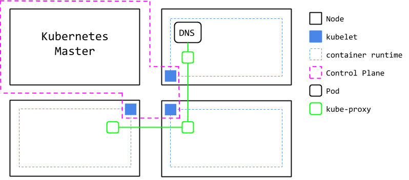

# 02: Services and Namespaces

In closing our discussion of Pods, we mentioned that Kubernetes will run some system Pods that provide functionality on top of allocating CPU and memory to containers. This functionality is networking, and is presented to the user via the Service API Object.



In the diagram, we can see that each node is running a pod called `kube-proxy`. Their responsibility is to reflect the network records managed by the DNS Pod. The DNS Pod typically runs `kube-dns`, but you can configure the cluster to use OpenDNS, for example.

The network of each Node's container runtime is wired into this system. This allows all Pods to talk to each other via IP, regardless of Node. 

But when it comes to configuring highly connected applications, we don't want to be operating off of IP addresses. Additionally, in some use cases there are many Pods running the same application, and we want to distribute requests across those Pods.

Enter the Service API Object. At a minimum, a Service definition consists of a name, a label selector, and ports. The name will be used to create an A record in the DNS Pod, which will look something like `my-service.default.svc.cluster.local`. Whenever a Pod in the cluster makes a request for that A record, the Service will distribute the request to one of the Pods with a label matching the selector.

Additionally, once the Service exists, every container started afterwards will be given the A record and ports as environment variables named according to the name of the service.

With this background, we will demonstrate a simple service. This time we will skip straight to running the code in Kubernetes. 

## Simple Service
Before executing the commands, take a look through the 2 applications present in this folder. You should see a Flask application, and a client application which uses some weird-looking environment variables and takes a CLI parameter. Also see their Kubernetes manifests in `config`. Note that the manifest for hello-world has both a Pod and a Service definition. When this manifest is applied, both resources will be created.

We have 2 manifests for deploying the `client` artifact. The `client-env` manifest runs `client` without any parameters, so it will fall back to using the environment variables. The `client-dns` manifest provides the cluster-internal URL as a parameter. The logs for both pods will indicate how the code resolved the URL.

```bash
cd 02

# build images
docker build hello-world/ -t hw:latest
docker build client/ -t client:latest

# hello-world
kubectl apply -f config/hello-world.yaml
kubectl get all
kubectl describe pod/hello-world-pod
kubectl describe service/hello-world-service

# client-env
kubectl apply -f config/client-env.yaml
kubectl get all
kubectl describe pod/client-env-pod
kubectl logs pods/client-env-pod # -> Received 200: Hello World

# client-dns
kubectl apply -f config/client-dns.yaml
kubectl get all
kubectl describe pod/client-dns-pod
kubectl logs pods/client-dns-pod # -> Received 200: Hello World

# clean up
kubectl delete -f config/hello-world.yaml
kubectl delete -f config/client-env.yaml
kubectl delete -f config/client-dns.yaml
```

Notes:
- The networking environment variables provided to the client containers take the form `${SERVICE_NAME}_SERVICE_HOST`. Because we named our Service `hello-world-service`, the resulting variable is `HELLO_WORLD_SERVICE_SERVICE_HOST`

## Port-forwarding
Sometimes, we need to send requests to our applications for debugging or testing purposes. `kubectl` provides a mechanism for this that doesn't involve permanently exposing ports on the cluster. The following commands assume you have the image `hw:latest` built from the previous section.

```bash
kubectl apply -f config/hello-world.yaml
kubectl get all
kubectl port-forward service/hello-world-service 9000:8080 # -> this command will block

# in another session:
curl localhost:9000 # -> Hello World
```

## Namespaces
Kubernetes Namespaces provide "virtual clusters" to deploy resources into. Resources are only aware of other resources in their namespace, and of non-namespaced objects such as PersistentVolumes. The [official docs on Namespaces](https://kubernetes.io/docs/concepts/overview/working-with-objects/namespaces/) are succinct as far as k8s documentation goes, so we won't discuss them in depth. I will emphasize a few points:

- Namespaces are intended to solve administrative problems for clusters with a large amount of resources and/or users
- The DNS records created by Services reference the namespace of the Service. For example, if we deployed hello-world into a namespace called `hello-ns`, the Service would be addressable by `hello-world-service.hello-ns.svc.cluster.local` from any namespace
- On the other hand, Pods created in a given namespace will not be loaded with the env variables corresponding to Services in other namespaces
- Deleting a Namespace deletes all resources within

## Conclusion
We've seen a basic Service configuration, and used it to interact with a web server. We've witnessed how the Service results in environment variables being loaded onto new Pods, and the name-based DNS record being available to all Pods. We have discussed the impact of Namespaces on the environment variables and DNS records created by Services.

This concludes our brief introduction to the basic Kubernetes API Objects. With this foundation, we can now introduce more complex API Objects. These objects, such as Deployments, StatefulSets, and PersistentVolumes will enable us to scale our applications, provide fault tolerace, and provide persistent state.

## References
- https://kubernetes.io/docs/concepts/services-networking/service/

# Exercises
1. Create a namespace, and repeat the above examples using the `--namespace` flag
1. Deploy hello-world and the clients into different namespaces
1. Deploy multiple Pods with the label `app: hello-world`, and see that the Service distributes requests among the pods
1. Deploy the client-env Pod before the hello-world Service, and see what error occurs
1. Instead of applying each manifest individually, try applying the entire config folder `kubectl apply -f config/`. Results may vary.

